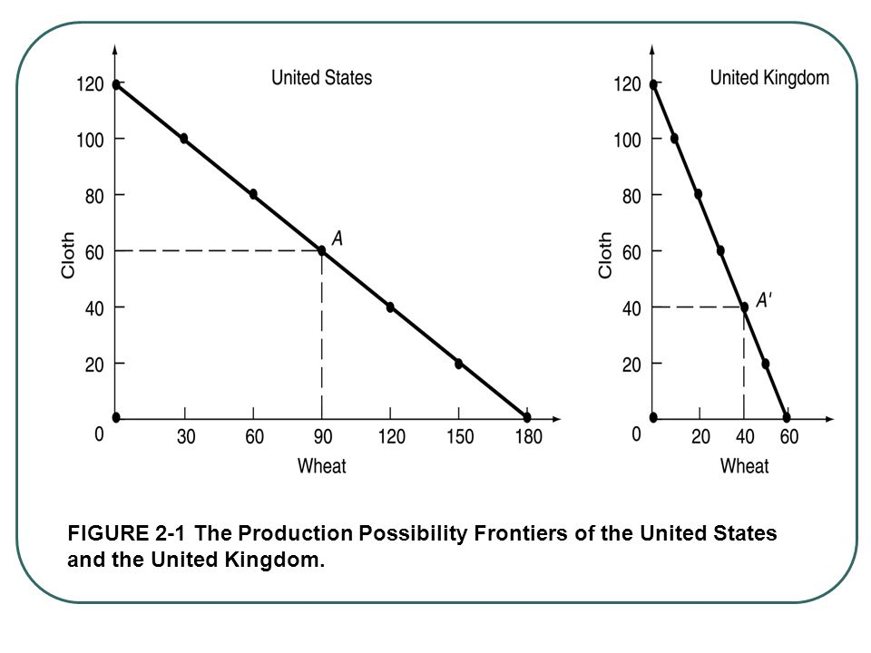
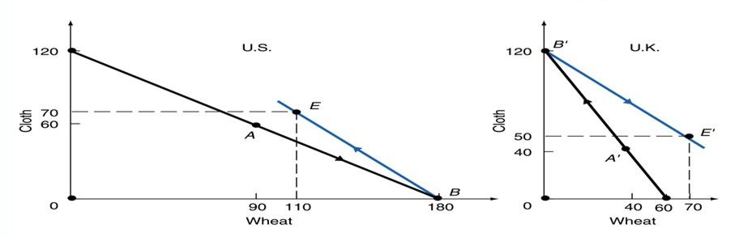
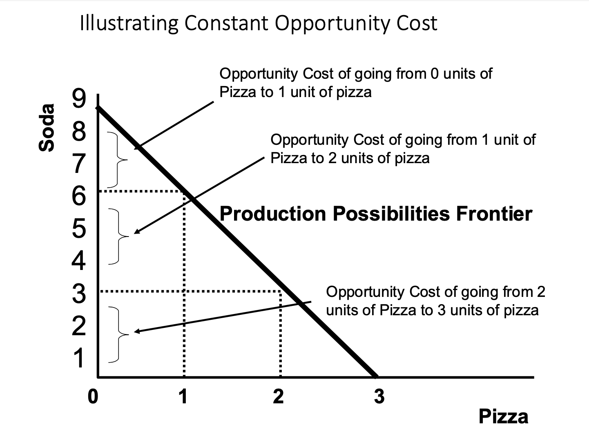
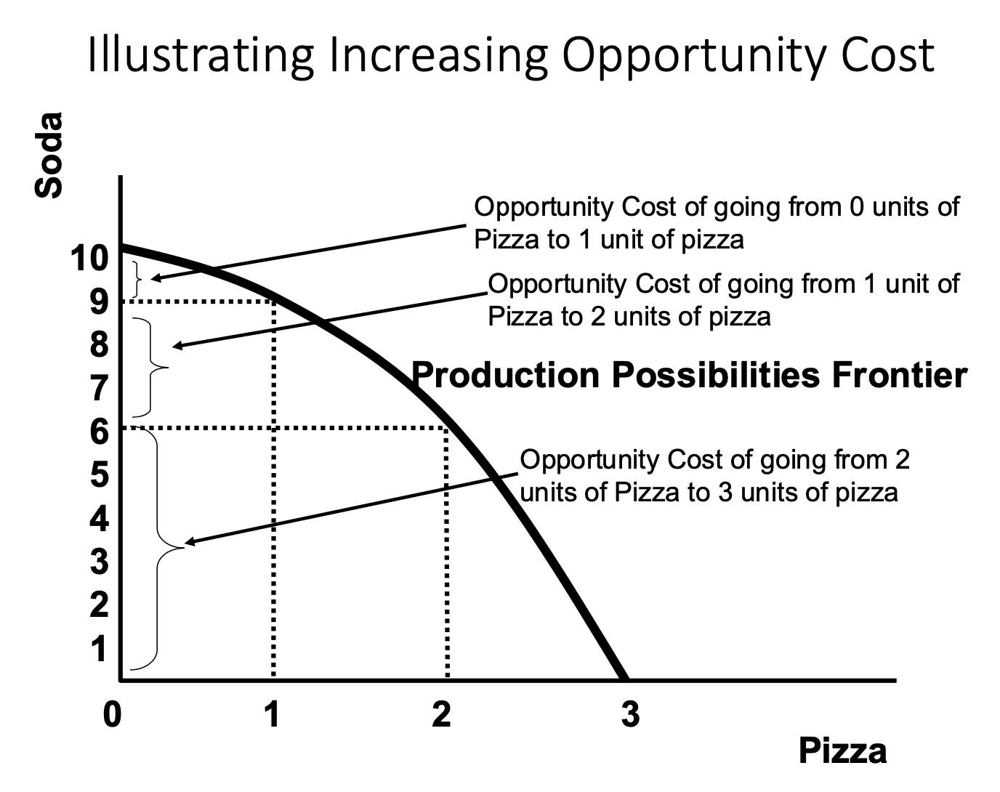
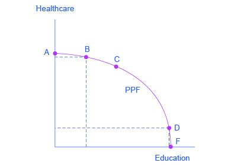
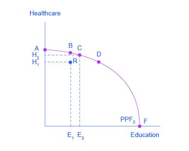

# International Trade Models

## Differences between absolute advantage and comparative advantage

|   | Absolute advantage | Comparative advantage |
|------------------------|------------------------|------------------------|
| Definition | Best at production of good or service | Production of good or service at lower cost |
| Benefits | Resources are focused on specific production | Resources are focused on efficient production, therefore, saving resources |
| Cost | Cost is noticed but not made priority over production | Cost is the primary factor to make production |
| Production | All resource allocation goes into production | Resource allocation varies and the main focus is not only production but also opportunity cost |
| Trade benefits | Trade is not mutually beneficial for two countries | Trade is mutually beneficial for two countries |
| Economic concept | Strategic management concept | Economic concept |
| Proponents | Adam Smith | David Ricardo |

: Differences between absolute and comparative advantage

## The opportunity cost theory

-   According to the opportunity cost theory, the cost of a commodity is the amount of a second commodity that must be given up to release just enough resources to produce one additional unit of the first commodity.

-   The nation with the lower opportunity cost in the production of a commodity has a comparative advantage in that commodity.

-   For example, if in the absence of trade the United States must give up two-thirds of a unit of cloth to release just enough resources to produce one additional unit of wheat domestically, then the opportunity cost of wheat is two-thirds of a unit of cloth.

Opportunity cost: The value of the next best alternative to any decision you make. For instance, the opportunity cost of watching movie is the hour of studying she gives up to do that. 

Constant opportunity costs: When the opportunity cost of a good remains constant as output of the good increases, which is represented as a PPF curve that is a straight line. 

Increasing opportunity costs: When the opportunity cost of a good increases as output of the good increases, which is represented in a graph as a PPF that is bowed out from the origin.

## The Production Possibility Frontier (PPF) under constant costs

-   Opportunity costs can be illustrated with the production possibility frontier, or transformation curve. The production possibility frontier is a curve that shows the alternative combinations of the two commodities that a nation can produce by fully utilizing all of its resources with the best technology available to it.

Table 3.4: Production possibility frontier of Wheat and Cloth production

| USA   |       | UK    |       |
|-------|-------|-------|-------|
| Wheat | Cloth | Wheat | Cloth |
| 180   | 0     | 60    | 0     |
| 150   | 20    | 50    | 20    |
| 120   | 40    | 40    | 40    |
| 90    | 60    | 30    | 60    |
| 60    | 80    | 20    | 80    |
| 30    | 100   | 10    | 100   |
| 0     | 120   | 0     | 120   |

-   Table 3.4 gives the (hypothetical) production possibility schedules of wheat (in million kg/year) and cloth (in million units/year) for the United States and the United Kingdom.

-   The United States and United Kingdom production possibility schedules given in Table 3.4 are graphed as production possibility frontiers in Figure 3.1. Each point on a frontier represents one combination of wheat and cloth that the nation can produce.

    

## The Basis for and the Gains from Trade under Constant Costs

-   In the absence of trade, a nation can only consume the commodities that it produces. As a result, the nation's production possibility frontier also represents its consumption frontier.

-   In the absence of trade, the United States might choose to produce and consume combination A (90W and 60C) on its production possibility frontier (see Figure 2.2), and the United Kingdom might choose combination A' (40W and 40C).

    

-   In the absence of trade, the United States produces and consumes at A , and the United Kingdom at A' . With trade, the United States specializes in the production of wheat and produces at B , while the United Kingdom specializes in the production of cloth and produces at B' . By exchanging 70W for 70C with the United Kingdom, the United States ends up consuming at E (and gains 20W and 10C), while the United Kingdom ends up consuming at E' (and gains 30W and 10C).

-   The increased consumption of both wheat and cloth in both nations was made possible by the increased output that resulted as each nation specialized in the production of the commodity of its comparative advantage.

## Shapes of Production Possibility Frontier

-   Production Possibilities Frontier (PPF) shows the maximum attainable combinations of two products that may be produced if we use our resources efficiently. Sometimes economists call this Production Possibilities Curve (PPC).

PPFs can be used to demonstrate:

a)  Opportunity costs (trade-offs).
b)  Efficient production.
c)  Economic growth

Understanding opportunity costs - The Shape of PPFs

-   Constant opportunity cost PPFs are

    -- Linear lines. Opportunity cost is constant (the same) no matter where you produce.

    

-   Increasing opportunity cost PPFs are

    -- Concave. As you keep increasing production, opportunity cost is increasing.

    

-   The PPF with increasing costs

It is more realistic for a nation to face increasing rather than constant opportunity costs. Increasing opportunity costs mean that the nation must give up more and more of one commodity to release just enough resources to produce each additional unit of another commodity. Increasing opportunity costs result in a production frontier that is concave from the origin (rather than a straight line).

## The Production Possibilities Frontier and Social Choices

-   Because society has limited resources (e.g., labor, land, capital, raw materials) at any point in time, there is a limit to the quantities of goods and services it can produce.

-   Suppose a society desires two products, healthcare and education. This situation is illustrated by the production possibilities frontier in this graph.

-   A Healthcare vs. Education Production Possibilities Frontier

{fig-align="center" width="400"}

-   In the graph, healthcare is shown on the vertical axis and education is shown on the horizontal axis. If the society were to allocate all of its resources to healthcare, it could produce at point A. But it would not have any resources to produce education.

-   If it were to allocate all of its resources to education, it could produce at point F.

-   Alternatively, the society could choose to produce any combination of healthcare and education shown on the production possibilities frontier.

-   Society can choose any combination of the two goods on or inside the PPF. But it does not have enough resources to produce outside the PPF.

-   Suppose society has chosen to operate at point B, and it is considering producing more education.the only way society can obtain more education is by giving up some healthcare. That is the trade-off society faces.

## The shape of the PPF and the law of diminishing returns

-   The law of diminishing returns, which holds that as additional increments of resources are added to a certain purpose, the marginal benefit from those additional increments will decline.

-   For instance, when government spends a certain amount more on reducing crime, for example, the original gains in reducing crime could be relatively large. But additional increases typically cause relatively smaller reductions in crime, and paying for enough police and security to reduce crime to nothing at all would be tremendously expensive.

-   The curvature of the production possibilities frontier shows that as additional resources are added to education, moving from left to right along the horizontal axis, the original gains are fairly large, but gradually diminish. Similarly, as additional resources are added to healthcare, moving from bottom to top on the vertical axis, the original gains are fairly large, but again gradually diminish. In this way, the law of diminishing returns produces the outward-bending shape of the production possibilities frontier.

## Productive Efficiency and Allocative Efficiency

The production possibilities frontier can illustrate two kinds of efficiency: productive efficiency and allocative efficiency. The following graph illustrates these ideas using a production possibilities frontier between healthcare and education.

-   Productive efficiency means that, given the available inputs and technology, it is impossible to produce more of one good without decreasing the quantity that is produced of another good. All choices on the PPF in this graph, including A, B, C, D, and F, display productive efficiency. As a firm moves from any one of these choices to any other, either healthcare increases and education decreases or vice versa. However, any choice inside the production possibilities frontier is productively inefficient and wasteful because it is possible to produce more of one good, the other good, or some combination of both goods.

-   Allocative efficiency means that the particular mix of goods a society produces represents the combination that society most desires. How to determine what a society desires can be a controversial question, and is usually discussed in political science, sociology, and philosophy classes as well as in economics. At its most basic, allocative efficiency means producers supply the quantity of each product that consumers demand. Only one of the productively efficient choices will be the allocatively efficient choice for society as a whole.

{fig-align="center" width="400"}

<!-- ## The Ricardian model of international trade -->

<!-- -   The Ricardian model of international trade states that the main reason why countries trade is that different countries have different productivity (or technologies) for producing different goods and services. -->

<!-- -   It shows how countries can gain from exporting goods that they are relatively better at making and importing goods that they are relatively worse at making. -->

<!-- ### The Ricardian theory -->

<!-- -   The Ricardian theory of comparative advantage is based on the idea that if there are technological differences in the production of goods across countries, -->

<!-- -   Countries can gain from trade by exporting goods for which the country has a lower opportunity cost of production and importing goods for which the country's opportunity costs of production are higher. -->

<!-- -   The model can be understood using a two-country, two-good and one factor of production example. -->

<!-- -   Suppose that the two countries are Home($h$) and Foreign($f$) and the two goods are Bread ($b$) and Cloth ($c$). -->

<!-- -   The lone factor of production is labor ($L$). -->

<!-- -   The production of one unit of each good in each country requires a certain amount of labor which is called the unit labor requirement. -->
