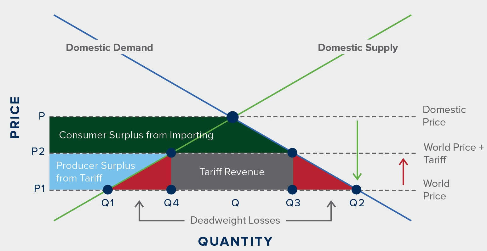
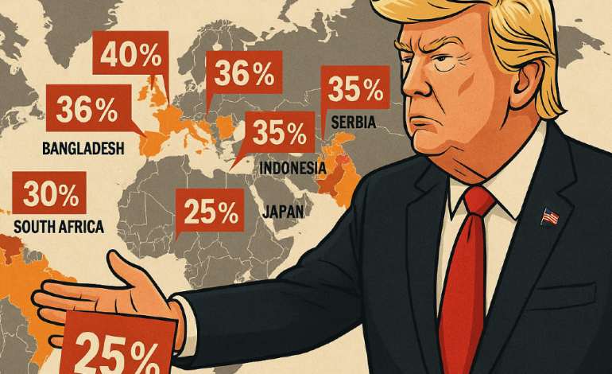

# The Instruments of Trade Policy

## Tariff

This lecture examines the policies that governments adopt toward international trade, policies that involve a number of different actions. These actions include taxes on some international transactions, subsidies for other transactions, legal limits on the value or volume of particular imports.

### Basic Tariff Analysis

-   **Tariff**: A tariff, the simplest of trade policies, is a tax levied when a good is imported.

-   **Specific Tariff**: Specific tariffs are levied as a fixed charge for each unit of goods imported (for example, \$3 per barrel of oil).

-   **Ad Valorem Tariff**: Ad valorem tariffs are taxes that are levied as a fraction of the value of the imported goods (for example, a 25 percent U.S. tariff on imported trucks—see the following box).

Tariffs are the oldest form of trade policy and have traditionally been used as a source of government income. Until the introduction of the income tax, for instance, the U.S. government raised most of its revenue from tariffs. Their true purpose, however, has usually been twofold: both to provide revenue and to protect particular domestic sectors.

### Historic Examples of Tariff

-   In the early 19th century, for example, the United Kingdom used tariffs (the famous Corn Laws) to protect its agriculture from import competition.

-   In the late 19th century, both Germany and the United States protected their new industrial sectors by imposing tariffs on imports of manufactured goods.

However, the importance of tariffs has declined in modern times because modern governments usually prefer to protect domestic industries through a variety of non-tariff barriers, such as import quotas (limitations on the quantity of imports) and export restraints (limitations on the quantity of exports—usually imposed by the exporting country at the importing country’s request).

### Effects of Tariff

Tariff barriers create obstacles to free trade

-   

    1.  Reduce the prospect of market access

-   

    2.  Reduce the volume of imports and exports

-   

    3.  Make imported goods more expensive

-   

    4.  Increase the production and consumption of domestic goods

-   

    5.  Customers are required to pay higher price for the same good in domestic market

-   

    6.  Protect domestic industries and increase government revenues of importing country

-   

    7.  Producers in domestic industry would feel better off due to imposition of tariff

-   

    8.  It prevents countries from enjoying gains from international trade arising out comparative cost advantage of other countries

{fig-align="center"}

### In a world of trade tensions, what do tariffs really do?

Trade policy tensions are escalating fast. In recent months, several large economies have announced or implemented sweeping new tariffs, reviving a policy tool that many thought to have been largely relegated to the past. These developments have sparked a flurry of political commentary — but behind the headlines, there exists a body of economic research that helps to make sense of what tariffs actually do.

{fig-align="center"}

-   At their core, tariffs are simple: they **raise the domestic price of imported goods**. But their effects ripple through the economy in complex ways — altering prices, wages, exchange rates and trade patterns. As governments revisit this powerful lever, understanding the economic mechanisms at play has never been more important.

-   At the most basic level, a tariff is a tax on imported products. It drives a wedge between the world price and the domestic price. For instance, if a 10 per cent tariff is imposed on a product with a world price of USD 100, the domestic price becomes USD 110. The difference — USD 10 — is collected as **tariff revenue, which the government can use to finance its expenditures**.

-   Tariffs can also **affect the world price of a product**, particularly when they are imposed by a large economy. The logic is that higher domestic prices reduce domestic demand, which in turn lowers world demand, and thus world prices. In our example, the world price might fall to USD 95 after the tariff is imposed, resulting in a domestic price of USD 104.50. In this case, part of the tariff is effectively paid by foreign producers.

-   Tariffs **do not just affect imports – they also affect exports**. One direct channel is through higher prices for intermediate goods, which undermine the competitiveness of exporting firms; but broader general equilibrium effects are also important. Tariffs allow import-competing sectors to expand, which draws resources — such as labor, capital and land — away from other sectors, including exporting sectors.

<!-- ## Heckscher--Ohlin model of trade -->

<!-- -   We now go one step further and explain the reason, or cause, for the difference in relative commodity prices and comparative advantage between the two nations. -->

<!-- -   Questions were left largely unanswered by Ricardo. According to Ricardo, comparative advantage was based on the difference in the productivity of labor among nations, but he provided no explanation for such a difference in productivity, except for possible differences in climate. -->

<!-- -   Named after two Swedish economists, Eli Heckscher and Bertil Ohlin, the Heckscher--Ohlin model studies the pattern of production and trade that arises when countries have different endowments of factors of production, such as labor, capital and land. -->

<!-- -   The Heckscher--Ohlin model of trade states that endowment differences among countries play a key role in determining the pattern of trade. -->

<!-- -   Heckscher--Ohlin Theorem: A country has a comparative advantage in the good that is relatively intensive in the country's relatively abundant factor. -->

<!-- ## The Krugman model of trade -->

<!-- -   The Krugman model or the model of trade based on internal economies of scale in production. -->

<!-- -   It shows how countries can gain from trade even in a world where countries have identical endowments and technologies, provided that production functions exhibit increasing returns to scale and consumers have a love for variety. -->
